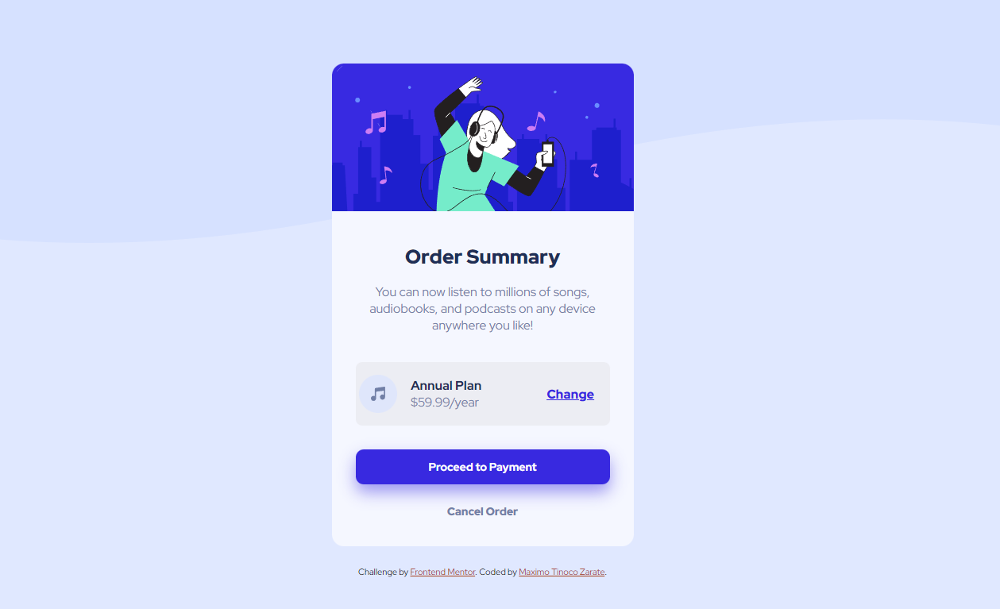
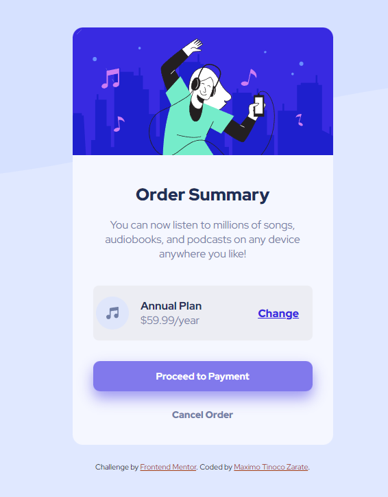

# Frontend Mentor - QR code component solution

This is a solution to the [QR code component challenge on Frontend Mentor](https://www.frontendmentor.io/challenges/qr-code-component-iux_sIO_H). Frontend Mentor challenges help you improve your coding skills by building realistic projects. 

### Screenshot






### Links

- Solution URL: [Add solution URL here](https://your-solution-url.com)
- Live Site URL: [Add live site URL here](https://your-live-site-url.com)


### Built with

- Semantic HTML5 markup
- CSS custom properties
- Flexbox
- CSS Grid
- Mobile-first workflow

### What I learned

I keep improving in the use of divs and classes to be able to better apply the designs to each label and I also learned to put a background for images.


```html
<div class="section-box">
            
            <div class="prices">
              <h3>Annual Plan</h3>
              <p class="money">$59.99/year</p>
            </div>
          <div class="a">
            <a href="#" class="change">Change</a>
          </div>
      </div>
```
```css
body{
    background:hsl(225, 100%, 94%);
    background-image: url(images/pattern-background-desktop.svg);
    background-repeat: no-repeat;
    background-size: 100% 40%;
    display: flex;
    flex-direction: column;
    justify-content: center;
    align-items: center;
    min-height: 100vh;
    font-family: 'Red Hat Display', sans-serif;
}
```


### Continued development

I want to focus more on being able to expand my knowledge and thus improve my mobile designs while improving on other topics.

## Author

- Name - Maximo Tinoco Zarate
- Frontend Mentor - [@MaximoTz](https://www.frontendmentor.io/profile/MaximoTz)


